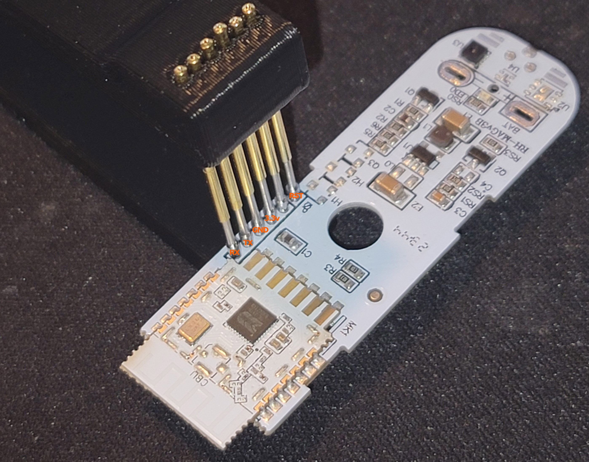

# RH-MAGv3B Temperature and Humidity Sensor

This is a Wi-Fi version of the sensor 

### Flashed using ltchiptool
- 
- 

### 3D printed tools
You have to pull PCB out of the sensor housing to flash.

 - https://www.thingiverse.com/azsasin/designs)
 - 
